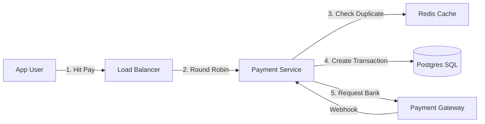

# 🏗️ System Design: The "Architect" View

For KeyValue/CoFee, Design isn't just drawing boxes. It's about "What happens when it breaks?".

---

## 💳 Service 1: The Payment System (CoFee)

**Core Goal:** Reliability. Zero lost money.

### 1. The Architecture (Mermaid Diagram)


### 2. The API Contract
*   **Endpoint:** `POST /api/v1/payments/initiate`
*   **Body:**
    ```json
    {
      "user_id": "u_123",
      "amount": 500.00,
      "currency": "INR",
      "idempotency_key": "uuid_v4_unique_string" 
    }
    ```
    *   *Note:* The `idempotency_key` is the most important field.

### 3. Failure Modes (The "What If" Questions)
*   **Q: What if the Bank takes money but the App crashes before updating the DB?**
    *   **A:** **Reconciliation Job**. A background script runs every night, downloads the Bank's CSV report, and compares it with our DB. If a success entry exists in Bank but not in DB, we fix it (Refund or Mark Success).
*   **Q: What if the user clicks Pay 10 times quickly?**
    *   **A:** Redis Lock. `SET resource_lock:u_123 NX EX 10`. Only the first request gets the lock. Others get "429 Too Many Requests".

---

## 🍿 Service 2: Netflix (Read-Heavy System)

**Core Goal:** Low Latency. Movies must start instantly.

### 1. Data Partitioning (Sharding)
How do we store 100 Million Users?
*   **Option A: Range Based:** User A-M in DB1, N-Z in DB2.
    *   *Problem:* What if all "A" users are active? DB1 dies. (Unbalanced).
*   **Option B: Consistent Hashing:** Hash(User_ID) % 4.
    *   *Benefit:* Even distribution.

### 2. Caching Strategy (LRU)
*   We can't query the DB for "Trending Movies" for every user.
*   **Strategy:** Compute "Trending" every hour. Store the JSON in **Redis**.
*   **User Hit:** App -> Redis (hit) -> Return. (2ms).
*   **Cache Miss:** App -> DB (slow) -> Update Redis -> Return.

---

## 🚗 Service 3: Uber (Geospatial)

**Core Goal:** Real-time updates.

### 1. The "QuadTree" Explained
Imagine the world map.
1.  Divide it into 4 squares (Quadrants).
2.  If a square has too many cars (> 100), divide it again into 4 smaller squares.
3.  Repeat.
This tree structure lets us quickly say "Give me all cars in Box A".

### 2. Driver Location Updates
*   **Not HTTP:** Drivers don't send `POST /location` every second. Overhead is too high.
*   **WebSocket / MQTT:** A lightweight, persistent channel. "I am here... I am here...".

---

## ☸️ General Scalability Patterns

### 1. Circuit Breaker Pattern
*   *Scenario:* The "Bank API" is down.
*   *Bad:* We keep sending requests, they keep failing, our server waits and hangs.
*   *Good (Circuit Breaker):* After 5 failures, **Open the circuit**. Stop sending requests for 1 minute. Insta-fail locally saying "Bank Maintenance".

### 2. Database Replication (Master-Slave)
*   **Master DB:** Handles all **Writes** (INSERT, UPDATE).
*   **Replica (Slave) DBs:** Handle all **Reads** (SELECT).
*   *Why?* Most apps read 10x more than they write.
